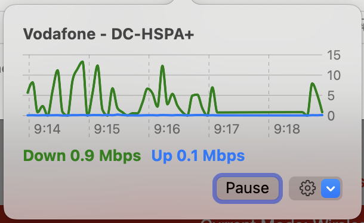

# ZTERtMonitor2

## Overview
This App fetchs traffic statistics from a ZTE consumer router (CPE) and shows them on status menu area.
Clicking on the status menu item will bring you a pop-over window with time-series graph of the traffic information.

Tested with Huawei MF255V, but supposed to work with other fixed and mobile consumer router models.

This App requires macOS 13 or later.

## Initial Setup
Click on the gear icon on the pop-over window to access the settings panel. Put account information for your router.
